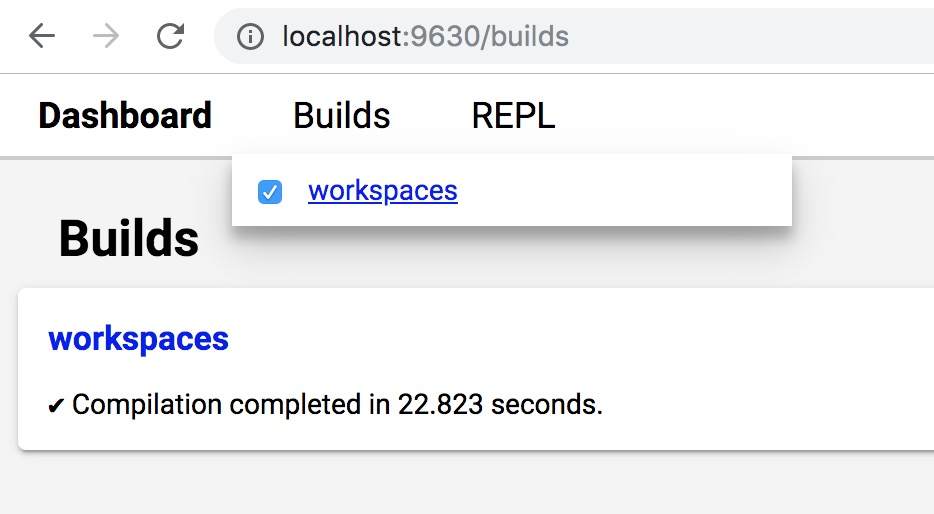
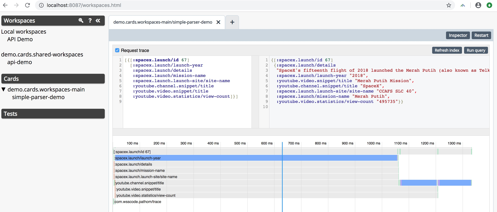

# Setup

## Install dependencies

```
$ npm install
```

## Run Server

`shadow-cljs` compiles ClojureScript to JavaScript, but also ships with features to serve, live-reload, etc. in development mode.


```
$ npx shadow-cljs server

shadow-cljs - HTTP server available at http://localhost:8087
shadow-cljs - server version: 2.8.18 running at http://localhost:9630
shadow-cljs - nREPL server started on port 59425
```


## Build Workspaces

Visit http://localhost:9630/builds and enable workspaces build.




## Open Workspaces

Visit http://localhost:8087/workspaces.html




## YouTube Secret Token

It's demo code, so you need to set your youtube-api secret-token in [src/demo/secret.cljs](src/demo/secret.cljs).


# Examples

There are sample queries in [src/demo/notes.cljs](src/demo/notes.cljs).


# Caveats

1. This is demo code ;)
2. There is an issue I have not tracked down with live-reloading of code.
   If you change the code, `shadow-cljs` will automatically compile and reload
   the code in your browser, but you may not notice the update in the
   `simple-parser-demo` card, until you press `Restart` button for the component.


# Credits

Huge amount of work has gone into the [Fulcro](https://fulcro.fulcrologic.com),
[Pathom](https://github.com/wilkerlucio/pathom),
and [shadow-cljs](http://shadow-cljs.org) projects.
Shout out to everyone contributing to the projects and the core maintainers
[Tony Kay](https://github.com/awkay),
[Wilker Lúcio](https://twitter.com/wilkerlucio),
and [Thomas Heller](https://twitter.com/thheller).

The parsing code was borrowed from @wilkerlucio's talks:

* [Scaling Full-Stack Applications](https://youtu.be/yyVKf2U8YVg)
* [Implementing Graph API's with Clojure](https://youtu.be/r3zywlNflJI)
* [wilkerlucio/pathom-connect-youtube](https://github.com/wilkerlucio/pathom-connect-youtube)
* [wilkerlucio/conj2018demo](https://github.com/wilkerlucio/conj2018demo)


# Resources

* [Fulcro](https://fulcro.fulcrologic.com)
* [Pathom](https://github.com/wilkerlucio/pathom)
* [shadow-cljs](http://shadow-cljs.org/)
